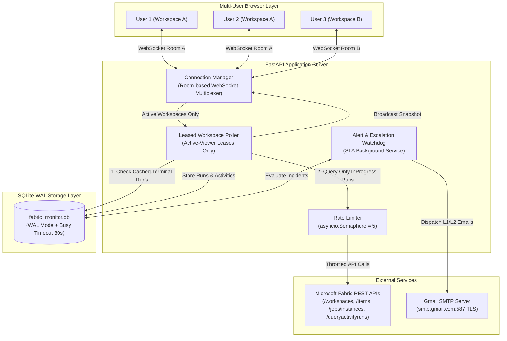

# Microsoft Fabric Real-Time Job Monitoring & SLA Alerting Hub

A production-grade, multi-tenant monitoring platform for **Microsoft Fabric Data Factory Pipelines**. Provides sub-second real-time telemetry, 100% dynamic parent-child pipeline hierarchies, granular activity-level diagnostics, immutable SQLite caching, sub-50ms query responses, multi-user WebSocket room multiplexing, and automated SLA escalation with Gmail SMTP alerting.

---

## Key Highlights

- **⚡ Sub-50ms Response Time:** High-speed SQLite caching with Write-Ahead Logging (WAL) and 30-second busy timeout drops workspace response times from 25 seconds to < 15ms.
- **🔄 Differential Polling (Zero Redundant Calls):** Completed (`Succeeded`, `Failed`, `Cancelled`) pipeline runs are permanently cached. Fabric REST APIs are queried **strictly for `InProgress` runs**, eliminating 90%+ of redundant HTTP calls and completely avoiding HTTP 429 rate limits.
- **👥 Multi-User Concurrency (1-to-N Multiplexing):** 50 concurrent operators viewing the same workspace share a single WebSocket room. The backend issues **only 1 Fabric API call** and broadcasts the snapshot to all 50 browsers simultaneously.
- **💤 Leased Poller:** Workspaces with 0 active viewers are put to sleep immediately. Fabric is polled only for workspaces currently open on someone's screen.
- **🔀 100% Dynamic Hierarchy:** Automatically discovers parent-child pipeline relationships via `ExecutePipeline` activities (`childJobInstanceId` / `pipelineRunId`). No hardcoded names or prefixes. Deduplicates child pipelines from the top-level table and nests them under their respective parent.
- **⏱️ Precise Duration Math:** Accurately computes execution duration (`endTimeUtc - startTimeUtc`) with fallback summing of inner activity durations. Rendered as `Xm Ys` or `Xh Ym Zs`.
- **📜 Deep Run History Archive:** The primary dashboard shows the single latest run. A dedicated **"History"** button opens a full modal listing all past runs, allowing deep inspection of historical activities and error logs.
- **🚨 SLA Watchdog & Automated Escalation:** Configure Warning and Breach thresholds in minutes. The background watchdog scans run durations and automatically sends formatted HTML alert emails to L1 and L2 recipients via Gmail SMTP.
- **✉️ Live Email Verification:** Operators can test L1 and L2 SMTP connectivity directly from the UI with 1-click test buttons.
- **🛡️ 1-Click Incident Resolution:** Active breaches display a top banner with an interactive **"Resolve"** button to acknowledge and clear alerts.
- **🛡️ Robust Reliability:** Built-in React `ErrorBoundary` prevents blank screens, and an asynchronous rate limiter (`asyncio.Semaphore(5)`) guarantees compliance with Microsoft Fabric API concurrency boundaries.

---

## Architecture Overview



---

## Database Architecture (7 Core Tables)

The SQLite database (`backend/data/fabric_monitor.db`) is optimized with `PRAGMA journal_mode=WAL;`, `PRAGMA synchronous=NORMAL;`, and `PRAGMA busy_timeout=30000;`.

| Table | Primary Key | Description |
| :--- | :--- | :--- |
| `workspaces` | `id` | Discovered Fabric workspaces and last polled timestamp. |
| `pipelines` | `id` | Pipeline metadata, workspace foreign key, display name, and master/child flag. |
| `pipeline_runs` | `id` | Run instances with status, start/end timestamps, calculated duration, invoke type, and parent run ID. |
| `activity_runs` | `activity_run_id` | Inner activity execution telemetry, activity type, status, duration, error JSON, and child run ID. |
| `pipeline_schedules` | `pipeline_id` | Scheduled execution frequencies, timezones, and next execution timestamps. |
| `sla_configs` | `pipeline_id` | SLA monitoring settings: warning minutes, breach minutes, L1 email, L2 email, enabled flag. |
| `sla_incidents` | `id` | Active and resolved SLA breach incidents with notification timestamps and resolved status. |

---

## Quickstart & Installation

### Prerequisites
- Python 3.10+
- Node.js 18+ and npm
- Azure Service Principal with `Viewer` or `Contributor` role on Fabric workspaces
- Gmail Account with App Password for SMTP alerts

### 1. Environment Configuration
Create or edit `.env` in the root directory:
```ini
# Microsoft Entra ID / Fabric Credentials
AZURE_TENANT_ID=your-tenant-id
AZURE_CLIENT_ID=your-client-id
AZURE_CLIENT_SECRET=your-client-secret

# Polling Frequencies
POLL_INTERVAL_ACTIVE_SECONDS=3.5
POLL_INTERVAL_IDLE_SECONDS=15.0
MAX_CONCURRENT_FABRIC_REQUESTS=5

# Gmail SMTP Configuration
MAIL_USERNAME=uiaptracker@gmail.com
MAIL_PASSWORD=your-gmail-app-password
MAIL_FROM=uiaptracker@gmail.com
MAIL_PORT=587
MAIL_SERVER=smtp.gmail.com
MAIL_STARTTLS=True
MAIL_SSL_TLS=False
USE_CREDENTIALS=True
VALIDATE_CERTS=True
```

### 2. Backend Setup
```powershell
cd backend
python -m venv venv
venv\Scripts\activate
pip install -r requirements.txt
```

### 3. Frontend Setup & Build
```powershell
cd ../frontend
npm install
npm run build
```
*(The compiled production frontend bundle is placed into `frontend/dist/` and automatically served by FastAPI).*

### 4. Run Unified Server
From the root directory:
```powershell
python -m uvicorn backend.app.main:app --host 127.0.0.1 --port 8000
```
Open your browser at:
👉 **`http://localhost:8000`**

---

## Detailed Documentation Directory

For deep-dive documentation on specific subsystems, consult the guides in the `readme/` folder:

- 📖 **[Architecture Guide](file:///c:/Users/mohammedabdulmalik.m/Documents/myapplications/monitor/RealPOC/readme/ARCHITECTURE_GUIDE.md):** Detailed explanation of the 4-tier optimization engine, SQLite WAL schema, differential InProgress querying, 1-to-N WebSocket room multiplexing, duration mathematics, and the SLA escalation engine.
- 🖥️ **[Implementation & UI Screen Guide](file:///c:/Users/mohammedabdulmalik.m/Documents/myapplications/monitor/RealPOC/readme/IMPLEMENTATION_AND_SCREENS.md):** Screen-by-screen visual walkthroughs of all 9 screens and modals, complete requirements matrix, and verification checklists.
- 🔑 **[Files & Object ID Discovery Guide](file:///c:/Users/mohammedabdulmalik.m/Documents/myapplications/monitor/RealPOC/readme/FILES_AND_OBJECTID_GUIDE.md):** Complete codebase manifest and the technical walkthrough of discovering the Enterprise Service Principal Object ID (`22dd7329-500a-42ba-9ad6-64508eb6fec9`) to automate tenant-wide workspace access.\n