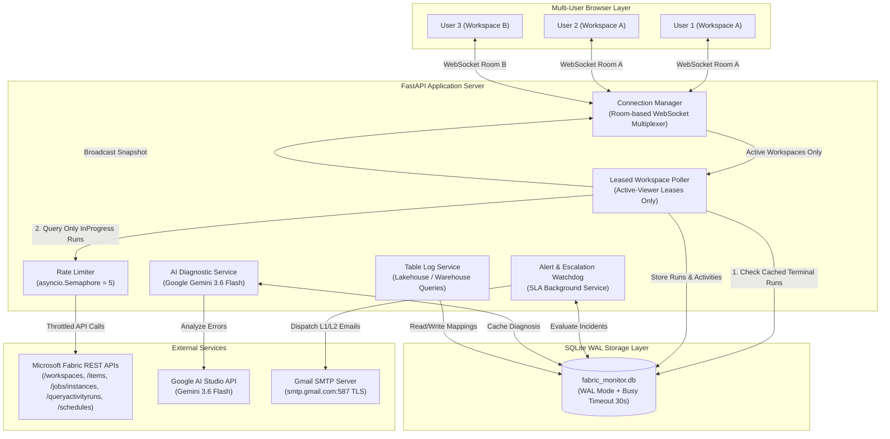

# Microsoft Fabric Real-Time Job Monitoring, AI Diagnostics & SLA Alerting Hub

A production-grade, multi-tenant monitoring and operations platform for **Microsoft Fabric Data Factory Pipelines**. Provides sub-second real-time telemetry, 100% dynamic parent-child pipeline hierarchies, granular activity diagnostics with **Google Gemini AI root-cause analysis**, dynamic Lakehouse/Warehouse table-level logging, date-based telemetry covering **Last Week to Next Week**, multi-schedule visibility, immutable SQLite caching with sub-50ms query responses, multi-user WebSocket room multiplexing, and automated SLA escalation with Gmail SMTP alerting.

---

## Key Highlights

- **⚡ Sub-50ms Response Time:** High-speed SQLite caching with Write-Ahead Logging (WAL) and 30-second busy timeout drops workspace response times from 25 seconds to < 15ms.
- **🔄 Differential Polling (Zero Redundant Calls):** Terminal runs (`Succeeded`, `Failed`, `Cancelled`) are permanently cached. Fabric REST APIs are queried **strictly for `InProgress` runs**, eliminating 90%+ of redundant HTTP calls and avoiding HTTP 429 rate limits.
- **📅 Date-Based Telemetry & Schedule Forecast Filter:**
  - **Covers Last Week to Next Week:** Quick presets for `Last Week`, `Yesterday (Last Day)`, `Today`, `Tomorrow (Next Day)`, `Next Week`, and `Latest / All`.
  - **Day-by-Day Navigator (15-Day Strip):** Interactive date buttons (Sep 05 → Sep 19) with emerald dots for recorded past runs and purple dots for upcoming forecast windows.
  - **Past Executions:** Displays exact pipeline runs for that date with dynamic counts: *Total, Running, Succeeded, Failed, Cancelled, and Not Run*.
  - **Future Schedule Forecast:** Evaluates pipeline schedules (Daily, Weekly day-of-week, recurrence times) to show *Scheduled to Run* vs *Not Scheduled*.
- **🤖 AI-Powered Error Diagnostics & Fix Guide:**
  - Integrated with **Google Gemini AI** (`gemini-3.6-flash`) for deep root-cause failure analysis.
  - Generates clear, step-by-step fix recommendations, remediation commands, and root-cause summaries.
  - Persistent SQLite caching via `ai_error_diagnostics` table for instant (< 5ms) subsequent loads and zero redundant AI token spend.
- **📊 Dynamic Lakehouse & Warehouse Table-Level Logging:**
  - **100% Dynamic Discovery:** Discovers Lakehouses, Warehouses, schemas, and tables via Fabric REST APIs with zero hardcoded values.
  - **Dynamic Column Mapping:** Maps user-selected columns for Batch Header, Bronze Log, and Silver Log tables.
  - **End-to-End Batch Lineage:** Correlates `pipeline_run_id` to Batch Header $\rightarrow$ ETL Batch Details $\rightarrow$ Bronze Logs $\rightarrow$ Silver Logs with source filtering (data load vs source delete), row counts, and status indicators.
- **⏰ Multi-Schedule Pipeline Visibility:**
  - Queries Fabric's official DataPipeline job schedules API (`/items/{itemId}/jobs/Pipeline/schedules`).
  - Renders all active and disabled schedules per pipeline with frequency, times, days of week, timezone, and next run time.
- **👥 Multi-User Concurrency (1-to-N Multiplexing):** 50 concurrent operators viewing the same workspace share a single WebSocket room. The backend issues **only 1 Fabric API call** and broadcasts the snapshot to all 50 browsers simultaneously.
- **💤 Leased Poller:** Workspaces with 0 active viewers are put to sleep immediately. Fabric is polled only for workspaces currently open on someone's screen.
- **🔀 100% Dynamic Hierarchy:** Automatically discovers parent-child pipeline relationships via `ExecutePipeline` activities (`childJobInstanceId` / `pipelineRunId`). Deduplicates child pipelines from the top-level table and nests them under their respective parent.
- **⏱️ Precise Duration Math:** Accurately computes execution duration (`endTimeUtc - startTimeUtc`) with fallback summing of inner activity durations. Overdue breaches format as clean days/hours/minutes (e.g. `+4d 3h 15m`).
- **📜 Deep Run History Archive:** Main view displays the filtered execution. A dedicated **"History"** button opens a full modal listing all past runs, allowing deep inspection of historical activities, error logs, and table-level telemetry.
- **🚨 SLA Watchdog & Automated Escalation:** Configure Warning and Breach thresholds in minutes. The background watchdog scans run durations and automatically sends formatted HTML alert emails to L1 and L2 recipients via Gmail SMTP.
- **🛡️ 1-Click Incident Resolution:** Active breaches display a clear badge with an interactive green **"Resolve"** button to acknowledge and clear alerts in SQLite.

---

## Architecture Overview



---

## Database Architecture (9 Core Tables)

The SQLite database (`backend/data/fabric_monitor.db`) is optimized with `PRAGMA journal_mode=WAL;`, `PRAGMA synchronous=NORMAL;`, and `PRAGMA busy_timeout=30000;`.

| Table | Primary Key | Description |
| :--- | :--- | :--- |
| `workspaces` | `id` | Discovered Fabric workspaces and last polled timestamp. |
| `pipelines` | `id` | Pipeline metadata, workspace foreign key, display name, and master/child flag. |
| `pipeline_runs` | `id` | Run instances with status, start/end timestamps, calculated duration, invoke type, and parent run ID. |
| `activity_runs` | `activity_run_id` | Inner activity telemetry, activity type, status, duration, error JSON, and child pipeline data. |
| `pipeline_schedules` | `pipeline_id` | Scheduled execution frequencies, timezones, recurrence days/times, and next run timestamps. |
| `sla_configs` | `pipeline_id` | SLA monitoring settings: L1 email, L2 email, SLA target minutes, updated timestamp. |
| `sla_incidents` | `id` | Active and resolved SLA breach incidents with notification timestamps and resolved status. |
| `table_log_mappings` | `workspace_id` | Dynamic Lakehouse/Warehouse IDs and column mappings for Batch Header, Bronze, and Silver logs. |
| `ai_error_diagnostics` | `error_hash` | Persistent cache of Gemini AI root-cause analysis and step-by-step fix recommendations. |

---

## Quickstart & Installation

### Prerequisites
- Python 3.10+
- Node.js 18+ and npm
- Azure Service Principal with `Viewer` or `Contributor` role on Fabric workspaces
- Gmail Account with App Password for SMTP alerts (optional)
- Google Gemini API Key for AI diagnostics (optional, pre-configured in `.env`)

### 1. Environment Configuration
Create or edit `.env` in the root directory:
```ini
# Microsoft Entra ID / Fabric Credentials
AZURE_TENANT_ID=your-tenant-id
AZURE_CLIENT_ID=your-client-id
AZURE_CLIENT_SECRET=your-client-secret

# Google Gemini API Key for AI Diagnostics
GEMINI_API_KEY=your-gemini-api-key

# Polling Frequencies & Rate Limits
POLL_INTERVAL_ACTIVE_SECONDS=3.5
POLL_INTERVAL_IDLE_SECONDS=15.0
MAX_CONCURRENT_FABRIC_REQUESTS=5

# Gmail SMTP Configuration
MAIL_USERNAME=uiaptracker@gmail.com
MAIL_PASSWORD=your-gmail-app-password
MAIL_FROM=uiaptracker@gmail.com
MAIL_PORT=587
MAIL_SERVER=smtp.gmail.com
MAIL_STARTTLS=True
MAIL_SSL_TLS=False
USE_CREDENTIALS=True
VALIDATE_CERTS=True
```

### 2. Backend Setup
```powershell
cd backend
python -m venv venv
venv\Scripts\activate
pip install -r requirements.txt
```

### 3. Frontend Setup & Build
```powershell
cd ../frontend
npm install
npm run build
```
*(The compiled production frontend bundle is placed into `frontend/dist/` and served automatically by FastAPI).*

### 4. Run Unified Server
From the root directory:
```powershell
backend\venv\Scripts\python.exe -m uvicorn backend.app.main:app --host 127.0.0.1 --port 8000
```
Open your browser at:
👉 **`http://localhost:8000`** (or `http://localhost:3000` during frontend development)

---

## Detailed Documentation Directory

For deep-dive documentation on specific subsystems, consult the guides in the `readme/` folder:

- 📖 **[Architecture Guide](./readme/ARCHITECTURE_GUIDE.md):** Detailed explanation of the 4-tier optimization engine, SQLite WAL schema, differential InProgress querying, 1-to-N WebSocket room multiplexing, duration mathematics, Gemini AI diagnostics caching, Lakehouse/Warehouse table logging, and the SLA escalation engine.
- 🖥️ **[Implementation & UI Screen Guide](./readme/IMPLEMENTATION_AND_SCREENS.md):** Screen-by-screen visual walkthroughs of all screens, DateFilterBar, AI Diagnostics Modal, Table Log Config & Dashboard, Multi-Schedule modal, and SLA configuration.
- 🔑 **[Files & Object ID Discovery Guide](./readme/FILES_AND_OBJECTID_GUIDE.md):** Complete codebase manifest across backend and frontend, and the technical walkthrough of discovering the Enterprise Service Principal Object ID to automate tenant-wide workspace access.