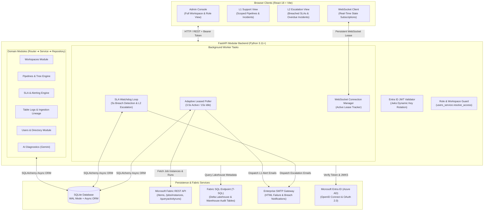
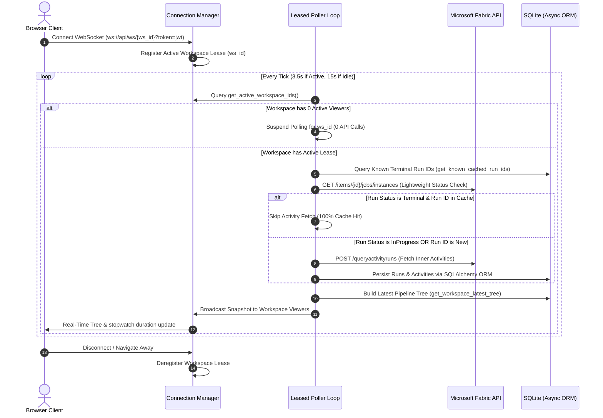
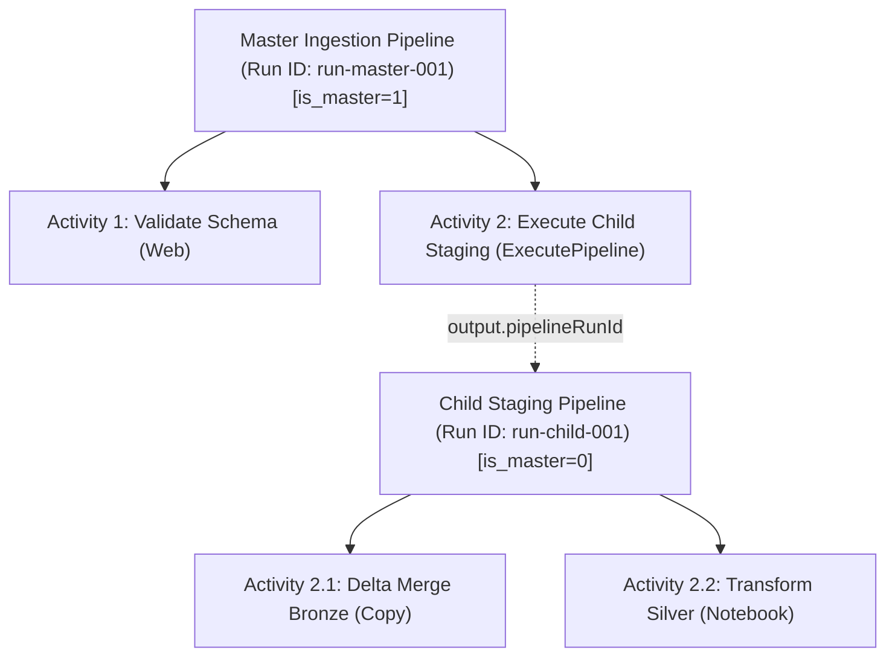
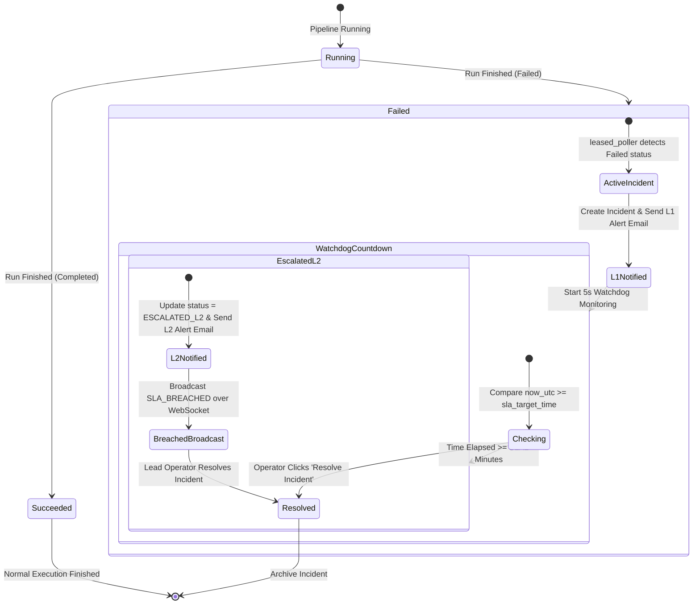
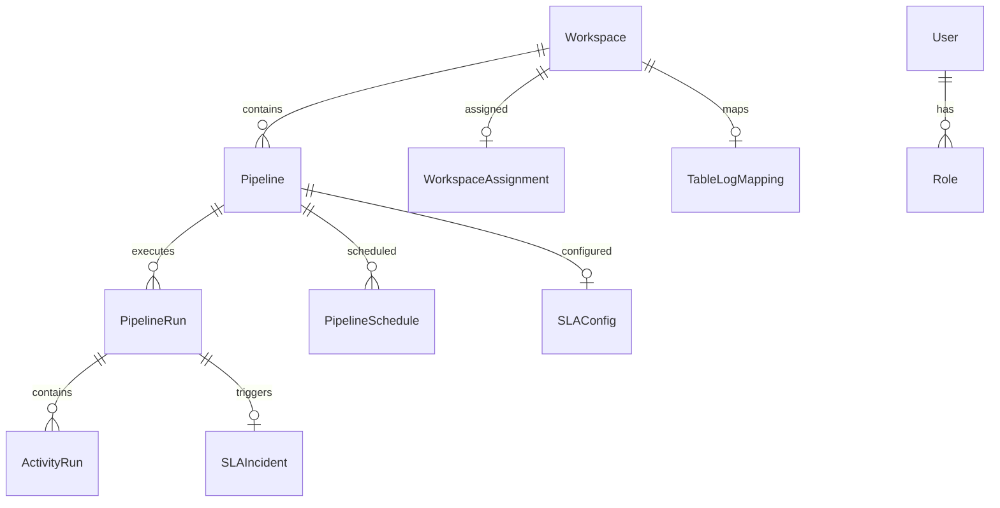

# Microsoft Fabric Real-Time Monitoring Hub — System Architecture

**Document Version:** 3.0  
**Updated:** 2026-09-26  
**Status:** Approved & Implemented  

---

## 1. Executive Architecture Overview

The **Microsoft Fabric Real-Time Monitoring Hub** is an enterprise-grade operational observability platform designed to monitor, track, audit, and diagnose complex data pipeline architectures executing across Microsoft Fabric workspaces.

The platform eliminates the latency, API rate-limiting, and visual clutter common to default monitoring tools by implementing:
1. **Adaptive Dual-Speed Leased Polling** that reduces Fabric API overhead by up to 80% while delivering sub-second real-time progress.
2. **Pure SQLAlchemy Async ORM Data Layer** guaranteeing high-throughput, type-safe database transactions with zero raw SQL vulnerability.
3. **Hierarchical Pipeline Tree Engine** that dynamically nests child pipelines invoked by `ExecutePipeline` activities inside parent runs, preventing cluttered orphan rows.
4. **Three-Tier Role-Based Access Control (RBAC)** providing strict view isolation for Administrators, L1 Support Leads, and L2 Escalation Owners.
5. **Two-Tier Automated SLA Alerting & Watchdog Escalation** delivering immediate L1 failure alerts and automated L2 breach escalations over SMTP and WebSockets.
6. **Direct Lakehouse/Warehouse Ingestion Audit Lineage** tracking end-to-end data loads across Batch Header, Bronze, and Silver Delta tables.
7. **Gemini AI Root-Cause Diagnostics** providing instant remediation guidance for pipeline failures.

---

## 2. End-to-End System Architecture



---

## 3. Layer Discipline & Software Architecture

The platform strictly follows the **Modular Clean Architecture** pattern. Every backend domain is self-contained with well-defined boundaries:

```
backend/app/modules/<module_name>/
├── models/         # SQLAlchemy 2.0 Declarative Table Models
├── schema.py       # Pydantic V2 Request & Response Serialization Schemas
├── repository.py   # Pure SQLAlchemy Async ORM Data Access & Queries
├── service.py      # Core Business Logic, Orchestration, Validation
├── router.py       # FastAPI Route Handlers & Dependency Injections
└── __init__.py     # Module Barrel Export
```

### Strict Architectural Invariants:
1. **Zero Raw SQL Policy**: All internal application tables (`workspaces`, `workspace_assignments`, `pipelines`, `pipeline_runs`, `activity_runs`, `pipeline_schedules`, `sla_configs`, `sla_incidents`, `table_log_mappings`, `ai_error_diagnostics`, `users`, `roles`, `refresh_tokens`) are accessed exclusively via **SQLAlchemy Async ORM** (`async_session_maker`, `select()`, `sqlite_upsert()`, `selectinload()`). Raw string queries (`cursor.execute("SELECT ...")`) are strictly forbidden.
2. **Router Simplicity**: Routers contain zero business logic and zero direct database queries. They accept validated Pydantic schemas, invoke the corresponding service, and return standardized responses.
3. **Service Independence**: Services orchestrate domain rules, interact with repositories, coordinate external APIs (Fabric, SMTP, Gemini), and broadcast WebSocket events.
4. **Repository Encapsulation**: Repositories encapsulate database access, abstracting transactions, upsert conflict resolution, and complex subqueries.

---

## 4. Leased Polling & In-Flight Re-run Mechanics

### 4.1 The Core Problem
Microsoft Fabric enforces rigorous API rate limits. In enterprise workspaces containing 20–50 complex pipelines and thousands of historical activities, polling every pipeline continuously causes **HTTP 429 (Too Many Requests)** throttling, application lag, and wasted compute.

### 4.2 The Leased Polling Architecture
To achieve optimal responsiveness while strictly respecting Fabric API quotas:



### 4.3 Adaptive Dual-Speed Polling
The leased poller dynamically adjusts its frequency based on workspace execution state:
- **Active Speed (`POLL_INTERVAL_ACTIVE_SECONDS = 3.5s`)**: Engaged when at least 1 pipeline in the workspace is actively `InProgress`. This provides live stopwatch duration counters and step execution streaming with zero perceptional lag.
- **Idle Speed (`POLL_INTERVAL_IDLE_SECONDS = 15.0s`)**: Automatically activated when all pipelines in the workspace are in terminal states (`Completed`, `Failed`, `Cancelled`). This reduces Fabric API calls by **80%** during idle windows.

### 4.4 Permanent Caching of Terminal Runs
Once a pipeline execution reaches a terminal status (`Completed`, `Failed`, or `Cancelled`) and its full activity hierarchy is recorded in SQLite:
- `get_known_cached_run_ids(workspace_id)` identifies runs that are already frozen.
- The poller completely skips requesting `/queryactivityruns` for these executions.
- The complete pipeline execution tree is served directly from the local database in **<15ms**.

### 4.5 Detailed Technical Lifecycle: Handling Succeeded Pipeline Re-runs
> **Critical Question:** *If a succeeded pipeline is cached in the table, what happens when an operator or schedule runs it again? Does it immediately show `InProgress`?*

Here is the exact lifecycle:
1. **Fabric Generates an Immutable Job Instance**: When triggered, Microsoft Fabric never overwrites or mutates the previous execution. Fabric generates a **new Job Instance with a brand-new GUID Run ID** (e.g. `run_id = "e91b402a-..."`) and initial status `InProgress` or `NotStarted`.
2. **Poller Instance Check**: On the next polling cycle, `leased_poller` queries `GET /workspaces/{ws_id}/items/{pipeline_id}/jobs/instances`. Fabric returns the new execution at the top of the list.
3. **Database Insertion & Latest Start Selection**: The poller saves the new run into the `pipeline_runs` table with its current start timestamp. In `pipeline_repository.get_workspace_latest_tree`, the latest execution per pipeline is selected using an ORM subquery:
   ```python
   latest_sub = (
       select(
           PipelineRun.pipeline_id,
           func.max(func.coalesce(PipelineRun.start_time, "1970-01-01")).label("max_start")
       )
       .where(PipelineRun.workspace_id == workspace_id)
       .group_by(PipelineRun.pipeline_id)
       .subquery()
   )
   ```
   Because the new run has the latest start timestamp, it immediately supersedes the previous run as the active execution row for that pipeline.
4. **Cache Miss & Live Tracking**: Because this new run ID is `InProgress`, it is not in `cached_terminal_run_ids`. The poller queries Fabric for its live inner activities and broadcasts the update snapshot over WebSockets.
5. **Immediate UI Transition**: The frontend instantaneously transitions the table row to the spinning blue **`In progress`** status badge with an active ticking duration stopwatch.
6. **Freezing Upon Completion**: Once the re-run finishes (`Completed`, `Failed`, or `Cancelled`) and all activities are stored, its run ID is added to the terminal cache. The previous run remains permanently preserved and accessible anytime via the **Run History** modal.

---

## 5. Parent-Child Pipeline Hierarchy & Dynamic Tree Building

### 5.1 The Root Cause of Monitoring Clutter
In enterprise Microsoft Fabric workflows, orchestration pipelines invoke child processing pipelines using `ExecutePipeline` activities. If displayed naively, child pipelines appear twice: once as an inner activity and once as a standalone root-level row, resulting in table clutter and confusion.

### 5.2 Dynamic Child Detection
The Hub automatically detects child pipelines and structures them into a clean hierarchy:
- **Parent / Master Pipelines (`is_master = 1`)**:
  - Independent pipelines that trigger workloads or run standalone.
  - Rendered at the root level of the table with expandable caret icons (`ChevronRight` / `ChevronDown`).
- **Child Pipelines (`is_master = 0, is_child = 1`)**:
  - Discovered dynamically by `leased_poller._fetch_activity_tree()`:
    - Inspects `output.pipelineRunId` and `input.pipeline.referenceName` of `ExecutePipeline` activities.
    - Recursively fetches the child run's inner activities.
    - Embeds the child execution directly inside `activity["childPipeline"]`.
  - Automatically flagged via `pipeline_repository.update_child_pipeline_flags()` so they **never render as separate orphan rows at the root level**.



---

## 6. Role-Based Access Control (RBAC) & View Isolation

The platform enforces strict role-based access control across both the backend API and the frontend user experience.

### 6.1 Role Definitions
| Role Identifier | Role Display Name | Primary Responsibilities |
|---|---|---|
| `admin` | **Administrator** | Full platform management, user administration, workspace assignment, column mapping configuration, and global pipeline visibility. |
| `l1` | **L1 Support Lead** | First-line operational monitoring, incident triaging, test email verification, and AI-assisted root-cause remediation for assigned pipelines. |
| `l2` | **L2 Escalation Owner** | Senior escalation contact for SLA breaches, reviewing critical pipeline outages and architectural bottlenecks for assigned pipelines. |

### 6.2 Access Matrix
| Capability / Feature | Administrator (`admin`) | L1 Support Lead (`l1`) | L2 Escalation Owner (`l2`) |
|---|:---:|:---:|:---:|
| **Workspace Selector** | All Workspaces | Only Assigned Workspaces | Only Assigned Workspaces |
| **Pipeline Table Visibility** | All Pipelines | Only Pipelines where L1 = User | Only Pipelines where L2 = User |
| **Metric Summary Cards** | Organization-wide | Scoped to Assigned Pipelines | Scoped to Assigned Pipelines |
| **Admin Console Tab** | Visible & Accessible | **Hidden** | **Hidden** |
| **Table Log "Map Columns"** | Configurable | **Hidden / Read-Only** | **Hidden / Read-Only** |
| **SLA Configuration Modal** | Editable & Saveable | **Locked / Hidden** | **Locked / Hidden** |
| **Run History & Telemetry** | Full Access | Full Access | Full Access |
| **Lakehouse Ingestion Logs** | Full Access | Full Access | Full Access |
| **Multi-Schedule Viewer** | Full Access | Full Access | Full Access |
| **AI Error Diagnostics** | Full Access | Full Access | Full Access |

### 6.3 RBAC Resolution Mechanics
1. **Token Validation**: The user authenticates with Microsoft Entra ID. The backend validates the JWT signature against Microsoft's public keys (`jwks_uri`) and extracts the user's email address.
2. **Access Scoping (`users_service.resolve_access`)**:
   - Queries `users` table for explicit role assignments.
   - Evaluates `workspace_assignments` to find workspaces where the user is designated as L1 or L2 contact.
   - Evaluates `sla_configs` to discover specific pipeline IDs assigned to the user.
3. **Workspace Filtering**: On the frontend, `scopedWorkspaces` restricts the workspace dropdown to only authorized workspace IDs for non-admin users.
4. **Pipeline Table Filtering**: Within an authorized workspace, `scopedPipelineTree` filters the pipeline tree:
   - For L1: `pipeline.slaConfig.l1Email.toLowerCase() === user.email.toLowerCase()`.
   - For L2: `pipeline.slaConfig.l2Email.toLowerCase() === user.email.toLowerCase()`.
5. **Metric Aggregation**: Metric cards (Total, In Progress, Succeeded, Failed, Cancelled, Not Run) compute exclusively over the user's scoped pipeline set.

---

## 7. Automated Alerting & Two-Tier SLA Escalation Engine



### 7.1 Failure Detection & L1 Incident Creation
1. When a pipeline execution reaches status `Failed`, `leased_poller` immediately invokes:
   ```python
   await alert_service.process_failed_run(
       workspace_id, pipeline_id, pipeline_name, pipeline_run_id, error_info, failed_at
   )
   ```
2. Checks whether an incident already exists for `pipeline_run_id`.
3. If not, creates a new record in `sla_incidents` (`status = 'ACTIVE'`, `sla_target_time = failed_dt + sla1_minutes`).
4. Dispatches an automated HTML alert email via SMTP to `l1_email` containing:
   - Pipeline Name, Failed Activity Target, and Run GUID.
   - Exact failure timestamp and SLA resolution countdown.
   - Structured error code, error type, and formatted log trace.
   - Deep link to the Monitoring Dashboard.
5. Records `l1_notified_at = now` and broadcasts an `INCIDENT_CREATED` WebSocket message to all active operators.

### 7.2 SLA Watchdog Loop & Automatic L2 Escalation
1. `AlertService._sla_monitor_loop` runs as an asynchronous background task, evaluating unresolved incidents every 5 seconds.
2. For each active incident, parses `sla_target_time` against current UTC time.
3. If `now_utc >= sla_target_time`:
   - Calculates the overdue duration (`overdue_min = overdue_seconds // 60`).
   - Retrieves the configured `l2_email` from `sla_configs`.
   - Sends an urgent escalation HTML email to `l2_email` marked with a pulsating red alert badge and overdue duration counter.
   - Updates the incident record in SQLite:
     ```python
     await sla_repository.update_incident(incident_id, {
         "status": "ESCALATED_L2",
         "l2_escalated_at": now_str,
         "updated_at": now_str,
     })
     ```
   - Broadcasts an `SLA_BREACHED` WebSocket notification with a red warning banner across the platform.

### 7.3 Incident Resolution
Operators can acknowledge and clear incidents directly from the UI:
- Invokes `POST /api/sla/incidents/{id}/resolve`.
- Sets `status = 'RESOLVED'`, `resolved_at = now`, and `resolved_by = operator_email`.
- Broadcasts `INCIDENT_RESOLVED` over WebSockets, resetting the UI alert state.

---

## 8. Multi-Schedule Management & Forecasting

Microsoft Fabric pipelines support multiple independent triggers (e.g. nightly full batch + hourly incremental delta loads). The Hub queries and caches trigger configurations from Fabric:
- **Schedule Ingestion**: Queries `GET /items/{pipeline_id}/jobs/Pipeline/schedules` for recurrence definitions.
- **Data Model**: Stores recurrence frequency (`FREQ=DAILY`, `FREQ=WEEKLY`), interval, scheduled execution times, local timezone, enabled status, and computed `next_run_time`.
- **UI Inspection**: In the `PipelineScheduleModal`, operators inspect all configured schedules, enabling precise forecasting of upcoming pipeline executions.

---

## 9. Lakehouse & Warehouse Ingestion Table Lineage

The Hub monitors audit tables across Microsoft Fabric Lakehouses and Warehouses, providing visibility into end-to-end data pipelines:

```
[External Sources]
       │
       ▼
┌──────────────────────────────────────────────┐
│ Batch Header Table (dbo.BatchHeader)         │
│  - BatchID, PipelineRunID, Start/End Time    │
└──────────────────────┬───────────────────────┘
                       │
       ┌───────────────┴───────────────┐
       ▼                               ▼
┌────────────────────────────┐  ┌────────────────────────────┐
│ Bronze Ingestion Table     │  │ Silver Processing Table    │
│  - Raw file copy logs      │  │  - Delta merge audit logs  │
│  - Rows Read, Rows Inserted│  │  - Rows Updated, Duration  │
└────────────────────────────┘  └────────────────────────────┘
```

- **Direct Fabric Connectivity**: Connects to the Fabric Lakehouse/Warehouse SQL Endpoint over T-SQL via `pyodbc` using the Azure access token.
- **Admin Column Mapping**: Admins define schemas and column mappings in `TableLogConfigPage` (`BatchID`, `PipelineRunID`, `RowsRead`, `RowsInserted`, `RowsUpdated`, `RowsRejected`).
- **Telemetry Display**: Displays detailed audit logs, execution duration, and row throughput per ingestion batch.

---

## 10. AI Diagnostics Engine (Gemini 1.5 Pro)

When a pipeline or inner activity fails, operators can trigger AI-assisted root-cause analysis:
1. Gathers pipeline metadata, activity type, error message, failure code, and raw log traces.
2. Invokes Google Gemini 1.5 Pro via the Deepmind / Google GenAI SDK.
3. Generates a structured diagnosis:
   - **Root Cause**: Plain-language explanation of why the failure occurred.
   - **Recommended Fix**: Step-by-step remediation commands and architectural advice.
   - **Confidence Score**: Algorithmic certainty metric (0.00 to 1.00).
4. Persists the result in `ai_error_diagnostics` keyed by a deterministic error hash (`error_hash = sha256(...)`), serving subsequent requests for identical errors instantly from cache.

---

## 11. Database Schema & SQLAlchemy ORM Models

The database uses SQLite in Write-Ahead Logging (WAL) mode managed by SQLAlchemy 2.0 Async ORM:



### Table Definitions:
1. **`workspaces`**: `id` (PK), `displayName`, `last_polled_at`.
2. **`workspace_assignments`**: `workspace_id` (PK), `workspace_name`, `l1_email`, `l2_email`, `sla1_minutes`, `sla2_minutes`, `table_config_done`, `assigned_by`, `updated_at`.
3. **`pipelines`**: `id` (PK), `workspace_id` (FK), `displayName`, `is_master`, `prefix`, `updated_at`.
4. **`pipeline_runs`**: `id` (PK), `pipeline_id` (FK), `workspace_id` (FK), `pipeline_name`, `status`, `start_time`, `end_time`, `duration_in_ms`, `invoke_type`, `is_child`, `parent_run_id`, `parent_activity_name`, `failure_reason`, `updated_at`.
5. **`activity_runs`**: `activity_run_id` (PK), `pipeline_run_id` (FK), `activity_name`, `activity_type`, `status`, `start_time`, `end_time`, `duration_in_ms`, `error`, `output`, `child_pipeline_run_id`, `child_pipeline_data`, `updated_at`.
6. **`pipeline_schedules`**: `pipeline_id` (PK), `workspace_id` (FK), `pipeline_name`, `enabled`, `schedule_type`, `next_run_time`, `time_zone`, `raw_configuration`, `updated_at`.
7. **`sla_configs`**: `pipeline_id` (PK), `workspace_id` (FK), `l1_email`, `l2_email`, `l1_name`, `l2_name`, `sla_minutes`, `sla1_minutes`, `sla2_minutes`, `updated_at`.
8. **`sla_incidents`**: `id` (PK), `pipeline_id` (FK), `pipeline_name`, `pipeline_run_id` (FK), `workspace_id` (FK), `status`, `failed_at`, `sla_target_time`, `l1_notified_at`, `l2_escalated_at`, `resolved_at`, `resolved_by`, `error_message`, `updated_at`.
9. **`table_log_mappings`**: `workspace_id` (PK), `artifact_type`, `artifact_id`, `artifact_name`, `server_fqdn`, `database_name`, `batch_header_schema`, `batch_header_table`, `batch_header_mapping`, `bronze_schema`, `bronze_table`, `bronze_mapping`, `silver_schema`, `silver_table`, `silver_mapping`, `updated_at`.
10. **`ai_error_diagnostics`**: `error_hash` (PK), `error_code`, `error_message`, `activity_type`, `pipeline_name`, `diagnosis_json`, `created_at`.
11. **`users`**: `id` (PK), `email` (Unique), `oid`, `display_name`, `role_id` (FK), `is_active`, `is_verified`, `last_login_at`, `created_at`.
12. **`roles`**: `id` (PK), `name`, `description`, `created_at`.
13. **`refresh_tokens`**: `id` (PK), `user_id` (FK), `token_hash`, `expires_at`, `revoked_at`, `created_at`.
