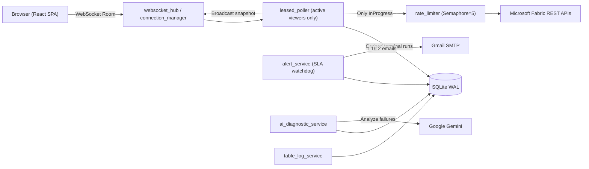

# System Architecture Document

**Last Updated:** 2026-09-23

## 1. Tech Stack
- **Frontend**: React 19 + Vite 8 (feature-based SPA), Tailwind CSS 4, lucide-react icons.
- **Auth (frontend)**: MSAL (`@azure/msal-browser` + `@azure/msal-react`) — Microsoft Entra ID SPA sign-in.
- **State**: Custom hook `useWorkspaceMonitoring` over native WebSocket + fetch (token-aware client).
- **Backend**: FastAPI (Python 3.10+), Uvicorn ASGI server.
- **Auth (backend)**: Entra ID JWT validation via JWKS (`PyJWT[crypto]`), RBAC guards.
- **Database**: SQLite with WAL mode (`backend/data/fabric_monitor.db`), `aiosqlite`.
- **Realtime**: Native WebSocket rooms via `connection_manager` / `websocket_hub`.
- **External APIs**: Microsoft Fabric REST, Google Gemini (AI diagnostics), Gmail SMTP (alerts).
- **Design source**: Microsoft Fabric UI kit (Figma) consumed via Figma MCP (Framelink).

## 2. System Overview & Data Flow


## 3. Authentication & RBAC Flow
```mermaid
sequenceDiagram
    participant U as User (Browser)
    participant M as MSAL (Entra ID)
    participant API as FastAPI
    participant DB as SQLite
    U->>M: Sign in (redirect)
    M-->>U: ID token (aud=client_id)
    U->>API: GET /api/auth/me (Bearer token)
    API->>API: Validate token via Entra JWKS
    API->>DB: Resolve role + assigned workspaces
    DB-->>API: role=admin|l1|l2, workspaces[]
    API-->>U: profile + role + scoped workspaces
    Note over U,API: Admin -> assignment console; L1/L2 -> scoped monitoring
```
- **Role resolution**: an explicit `admin` role in the `users` table wins (bootstrapped from
  `ADMIN_EMAILS` at startup). Otherwise role/scoping is derived from `workspace_assignments`
  (matches signed-in email to L1/L2 columns) and synced back onto the user's `role_id`.
- **Scoping**: every workspace/pipeline API filters by the caller's assigned workspaces
  (admin bypasses the filter).

## 4. Layer Separation & Invariants (Target Restructure)
Backend migrates from flat `services/` + `api/` toward feature **modules** while keeping the
existing `aiosqlite` `db_service` as the shared data layer.
1. **Modules** (`app/modules/<domain>/`): `router.py` → `service.py` → (data via `db_service`
   or a module `repository.py`), `schema.py`, `dependency.py`, `models/`. Domains: `auth`,
   `users` (router/service/repository/schema/models), plus planned `workspaces`, `pipelines`,
   `sla`, `table_logs`, `diagnostics`, `schedules`.
2. **Core** (`app/core/`): `config.py` (settings inc. Entra ID), `rate_limiter.py`, `security.py`.
3. **Data Layer** (`app/services/db_service.py`): all SQLite access. Routers never touch DB directly.
4. **Services** (`app/services/`): cross-cutting engines — `leased_poller`, `fabric_client`,
   `ai_diagnostic_service`, `alert_service`, `table_log_service`, `tree_builder`, `connection_manager`.
5. **Schemas**: Pydantic V2 models per module for request/response validation.

## 4. Key Architectural Decisions
- **Differential polling**: terminal runs (`Succeeded`/`Failed`/`Cancelled`) cached forever;
  only `InProgress` runs re-queried → avoids HTTP 429.
- **Leased poller**: workspaces with 0 viewers sleep immediately.
- **1-to-N multiplexing**: N viewers of one workspace share 1 Fabric call.
- **SQLite WAL**: `journal_mode=WAL`, `synchronous=NORMAL`, `busy_timeout=30000`.
- **AI cache**: `ai_error_diagnostics` keyed by `error_hash` for zero repeat token spend.

## 5. Database Tables
Monitoring (existing): `workspaces`, `pipelines`, `pipeline_runs`, `activity_runs`,
`pipeline_schedules`, `sla_configs`, `sla_incidents`, `table_log_mappings`, `ai_error_diagnostics`.
- `sla_configs` is **per pipeline** and gained `sla1_minutes` (warning → L1) and `sla2_minutes`
  (breach → L2). `sla_minutes` mirrors SLA1 for the existing alert engine.

Parent-pipeline SLA endpoint:
- `GET /api/workspaces/{id}/parent-pipelines?force_sync=` → `[{pipelineId, pipelineName,
  sla1Minutes, sla2Minutes}]` (parents = `pipelines.is_master = 1`; `force_sync` polls Fabric).
- `POST /api/workspaces/{id}/pipelines/{pid}/sla` accepts `sla1Minutes` / `sla2Minutes`.

New (auth/RBAC):
- `roles` — `id` (PK: `admin`|`l1`|`l2`), `name`, `description`, `created_at`. Seeded on startup.
- `users` — `id` (PK), `email` (unique), `display_name`, `oid`, `role_id` (FK → `roles.id`),
  `is_active`, `created_at`, `last_login_at`.
- `workspace_assignments` — `workspace_id` (PK), `workspace_name`, `l1_email`, `l2_email`,
  `sla1_minutes`, `sla2_minutes`, `table_config_done`, `assigned_by`, `updated_at`.
  (L1/L2 emails are workspace-level; SLA1/SLA2 thresholds live per parent pipeline in `sla_configs`.)

## 6. Target Folder Structure
**Backend** (feature-based modules over shared services):
```
backend/app/
  core/         config.py, security.py, rate_limiter.py
  modules/
    auth/       router.py, service.py, schema.py, dependency.py
    workspaces/ router.py, service.py, schema.py
    ... (pipelines, sla, table_logs, diagnostics, schedules)
  services/     leased_poller, fabric_client, db_service, alert_service, ...
  models/       monitoring.py (Pydantic)
  main.py
```
**Frontend** (feature-based SPA per project-scaffold):
```
frontend/src/
  config/       authConfig.js, appConfig.js
  routes/       AppRoutes.jsx, PrivateRoute.jsx, RoleRoute.jsx
  services/     api/apiClient.js, api/endpoints.js
  components/   ui/, shared/, layout/ (Fabric shell)
  features/
    auth/       context/AuthContext, hooks/useAuth, components/LoginPage
    admin/      WorkspaceAssignment, SlaConfig, TableConfig
    monitoring/ PipelineTreeTable, DateFilterBar, hooks/useWorkspaceMonitoring
    diagnostics/ table-logs/ schedules/
```
- Dev: Vite serves on `:3000` (proxies `/api` and `/ws` to `:8000`).
- Prod: `npm run build` → `frontend/dist/` served by FastAPI on `:8000`.

See `readme/ARCHITECTURE_GUIDE.md` for the deep-dive subsystem walkthrough.
