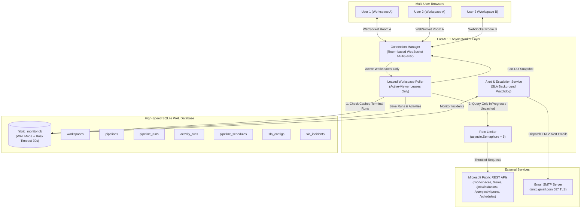
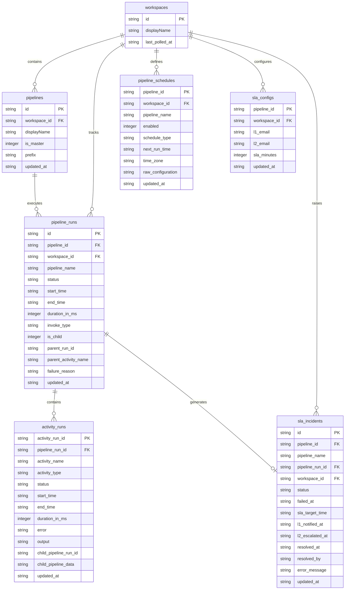
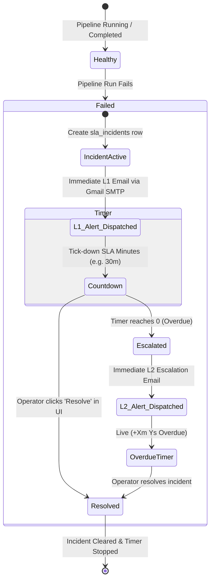

# Microsoft Fabric Real-Time Job Monitoring: Comprehensive Architecture Guide

This document provides the complete, production-grade architectural specification for the **Microsoft Fabric Real-Time Job Monitoring & SLA Alerting Hub**. It details how sub-50ms telemetry delivery is achieved, how SQLite caching eliminates redundant API calls, how multi-user and multi-workspace concurrency is managed without hitting Fabric rate limits, and how automated SLA escalation operates.

---

## 1. High-Level System Architecture



---

## 2. Optimization Architecture: Sub-50ms Response & Zero Redundant Calls

In the initial implementation, querying Microsoft Fabric directly for all workspaces, pipelines, and activities took **15 to 25 seconds per refresh** and quickly risked HTTP 429 (`Too Many Requests`) rate limiting. 

To solve this, the platform introduces a **4-tier optimization engine**:

```
 ┌─────────────────────────────────────────────────────────────────────────────┐
 │ Tier 1: Multi-User WebSocket Room Multiplexing                             │
 │   50 users viewing the same workspace share 1 WebSocket room.              │
 │   FASTAPI MAKES ONLY 1 FABRIC CALL — fans out result to all 50 browsers.   │
 ├─────────────────────────────────────────────────────────────────────────────┤
 │ Tier 2: Leased Active-Viewer Poller                                         │
 │   Workspaces with 0 active viewers are put to SLEEP.                        │
 │   Fabric is polled ONLY for workspaces currently on someone's screen.       │
 ├─────────────────────────────────────────────────────────────────────────────┤
 │ Tier 3: Immutable Terminal Run Caching (Differential Polling)               │
 │   Completed, Failed, and Cancelled pipeline runs NEVER change.              │
 │   Their activity trees are fetched ONCE, stored in SQLite, and NEVER       │
 │   re-queried from Fabric. Only 'InProgress' runs trigger Fabric queries.   │
 ├─────────────────────────────────────────────────────────────────────────────┤
 │ Tier 4: SQLite WAL Cache (< 15ms Query Response)                            │
 │   Subsequent snapshot queries are read directly from local indexed SQLite   │
 │   tables, dropping response latency from 20s to < 15ms.                    │
 └─────────────────────────────────────────────────────────────────────────────┘
```

---

## 3. Database Schema & Storage Architecture

The local database (`backend/data/fabric_monitor.db`) runs under SQLite with **Write-Ahead Logging (WAL)** enabled (`PRAGMA journal_mode=WAL;`), normal synchronous mode (`PRAGMA synchronous=NORMAL;`), and a **30-second busy timeout** (`PRAGMA busy_timeout=30000;`) to eliminate database locks during high concurrent read/write loads.

### Complete Table Catalog



### Table Definitions & Purpose

1. **`workspaces`**:
   - `id` (TEXT, PK): Unique Microsoft Fabric workspace GUID.
   - `displayName` (TEXT): Workspace name.
   - `last_polled_at` (TEXT): ISO timestamp of last synchronization.

2. **`pipelines`**:
   - `id` (TEXT, PK): Fabric Data Pipeline item GUID.
   - `workspace_id` (TEXT): Workspace GUID.
   - `displayName` (TEXT): Pipeline name.
   - `is_master` (INTEGER): `1` for parent-level root pipelines, `0` for invoked sub-pipelines.
   - `prefix` (TEXT): Family grouping prefix (e.g., `azuresql_03`).
   - `updated_at` (TEXT): Timestamp.

3. **`pipeline_runs`**:
   - `id` (TEXT, PK): Pipeline execution job instance GUID.
   - `pipeline_id` (TEXT): Pipeline GUID.
   - `workspace_id` (TEXT): Workspace GUID.
   - `pipeline_name` (TEXT): Pipeline name.
   - `status` (TEXT): Current state (`InProgress`, `Completed`, `Failed`, `Cancelled`, `No Runs`).
   - `start_time` / `end_time` (TEXT): Execution UTC timestamps.
   - `duration_in_ms` (INTEGER): Calculated elapsed execution duration in milliseconds.
   - `invoke_type` (TEXT): Trigger type (`Manual`, `Scheduled`).
   - `is_child` (INTEGER): `1` if triggered by another pipeline, `0` if standalone.
   - `parent_run_id` (TEXT): Execution ID of parent run (if sub-pipeline).
   - `parent_activity_name` (TEXT): Name of `ExecutePipeline` activity that invoked this run.
   - `failure_reason` (TEXT): Serialized error JSON.

4. **`activity_runs`**:
   - `activity_run_id` (TEXT, PK): Unique activity execution GUID.
   - `pipeline_run_id` (TEXT): Foreign key to `pipeline_runs.id`.
   - `activity_name` (TEXT): Activity display name (e.g. `Bronze To Silver NB`).
   - `activity_type` (TEXT): Type (`Copy`, `ExecutePipeline`, `TridentNotebook`, `Lookup`, etc.).
   - `status` (TEXT): Execution status (`Succeeded`, `Failed`, `InProgress`, `Inactive`).
   - `start_time` / `end_time` (TEXT): UTC timestamps.
   - `duration_in_ms` (INTEGER): Milliseconds taken.
   - `error` (TEXT): Structured error JSON (`errorCode`, `message`, `failureType`).
   - `output` (TEXT): Raw activity execution output.
   - `child_pipeline_run_id` (TEXT): Execution ID of invoked child pipeline.
   - `child_pipeline_data` (TEXT): **Full recursive sub-pipeline execution tree stored as JSON**, enabling infinite-depth hierarchy reconstruction with zero extra queries.

5. **`pipeline_schedules`**:
   - Stores schedule type, enabled state, next scheduled run time, timezone, and raw cron configuration.

6. **`sla_configs`**:
   - Stores user-defined SLA threshold (`sla_minutes`), L1 alert recipient(s), and L2 escalation recipient(s) per pipeline.

7. **`sla_incidents`**:
   - Tracks active, breached, escalated, and resolved failure incidents. Manages countdown deadlines, alert dispatches, and resolution audit trails.

### High-Performance Indexes
```sql
CREATE INDEX IF NOT EXISTS idx_runs_ws ON pipeline_runs(workspace_id);
CREATE INDEX IF NOT EXISTS idx_runs_pipe ON pipeline_runs(pipeline_id);
CREATE INDEX IF NOT EXISTS idx_runs_status ON pipeline_runs(status);
CREATE INDEX IF NOT EXISTS idx_act_run ON activity_runs(pipeline_run_id);
CREATE INDEX IF NOT EXISTS idx_inc_ws ON sla_incidents(workspace_id);
CREATE INDEX IF NOT EXISTS idx_inc_pipe ON sla_incidents(pipeline_id);
CREATE INDEX IF NOT EXISTS idx_inc_status ON sla_incidents(status);
```

---

## 4. Differential & Terminal Polling: How Only In-Progress Runs Are Queried

Microsoft Fabric enforces strict API limits (~200–300 requests per minute). Repeatedly querying activities for finished runs rapidly leads to HTTP 429 errors.

### The Algorithm:
1. **Identification of Known Terminal Runs (`get_known_cached_run_ids`)**:
   ```sql
   SELECT DISTINCT r.id 
   FROM pipeline_runs r
   INNER JOIN activity_runs a ON r.id = a.pipeline_run_id
   WHERE r.workspace_id = ? 
     AND r.status IN ('Completed', 'Failed', 'Cancelled')
     AND r.id NOT IN (
         -- Exclude runs where an ExecutePipeline activity's child tree has not yet been cached
         SELECT DISTINCT pipeline_run_id 
         FROM activity_runs 
         WHERE (LOWER(activity_type) LIKE '%executepipeline%' OR LOWER(activity_type) LIKE '%invokepipeline%')
           AND child_pipeline_data IS NULL
     );
   ```
2. **Execution Bypass**:
   During every 3.5s background poll loop:
   - The poller retrieves recent instances via `GET /items/{id}/jobs/instances`.
   - If `run.id in cached_terminal_run_ids`, **it immediately skips querying `/queryactivityruns`**.
   - **Only runs with `status IN ('InProgress', 'Running')` or newly completed runs that have not yet been indexed are sent to the Fabric API.**
3. **Permanent Cache Lock**:
   As soon as an `InProgress` run transitions to `Completed` or `Failed`, its final activity telemetry and error diagnostics are fetched **once**, saved into SQLite, and permanently locked into the cache.

---

## 5. Multi-User Concurrency & Workspace Isolation

The system is designed to support **50+ concurrent users across 100+ workspaces**:

### 1-to-N WebSocket Multiplexing
- In `connection_manager.py`, incoming WebSocket connections are segregated into rooms:
  ```python
  self._active_connections: Dict[str, Set[WebSocket]] = {}
  # Key is workspace_id: room contains all connected users viewing that workspace
  ```
- When 20 users open `AllConnChk`, all 20 sockets join the `AllConnChk` room.
- The backend poller executes **exactly 1 query** to Fabric every 3.5 seconds.
- The single JSON response is broadcasted asynchronously to all 20 connected browsers.
- **Adding 50 more users to the same workspace adds 0 additional API calls to Microsoft Fabric!**

### Leased Polling Lifecycle
- The poller queries `connection_manager.get_active_workspace_ids()`.
- If no user is viewing Workspace X, **no API calls are ever made for Workspace X**.
- When User A opens Workspace X, the poller acquires an active lease and begins background synchronization.
- When User A closes their browser tab, the lease expires, and Workspace X enters sleep mode.

### Multi-Workspace Partitioning
- In SQLite, all queries and mutations enforce `WHERE workspace_id = ?`.
- Multiple workspaces being viewed simultaneously by different user groups operate in isolated channels with dedicated WebSocket broadcasts.

---

## 6. 100% Dynamic Parent-Child Pipeline Role Resolution

A major architectural challenge in Microsoft Fabric is that sub-pipelines invoked by an orchestrator pipeline are normal Data Pipeline items in the workspace. Without intelligent correlation, child pipelines appear as separate, confusing rows on the main view.

### The Zero-Hardcoding Telemetry Resolution:
1. When activities are fetched, any activity of type `ExecutePipeline` or `InvokePipeline` contains:
   - Invoked `pipelineRunId` in `activity.output`.
   - Invoked `pipelineId` or `pipelineName` in `activity.child_pipeline_data`.
2. In `db_service.py` `update_child_pipeline_flags`:
   - Recursively extracts all invoked pipeline GUIDs and display names from `activity_runs.child_pipeline_data` and `activity_runs.output`.
   - Any pipeline referenced as a child is flagged with `is_master = 0`.
   - **Any pipeline NOT invoked by another pipeline is flagged with `is_master = 1` and appears at the parent level.**
3. **Zero Keyword Checks**: No hardcoded checks for `"master"`, `"pl_"`, or source names. Whether a pipeline is named `MasterPipeline`, `pipeline1`, or `BronzeToSilver`, its role is determined 100% dynamically based on whether it is invoked by another pipeline.

---

## 7. Duration Computation Engine

### The Problem:
Microsoft Fabric's `/jobs/instances` endpoint returns `startTimeUtc` and `endTimeUtc`, but omits `durationInMs` (`null`). As a result, pipeline rows initially rendered with blank duration (`—`).

### The Solution (Dual-Engine Fallback):
1. **Timestamp Mathematics**:
   $$\text{Duration (ms)} = \text{Date}(\text{endTimeUtc}) - \text{Date}(\text{startTimeUtc})$$
   Calculated at database insert time in `save_pipeline_runs` and query time in `get_workspace_latest_tree`.
2. **Activity Aggregation Fallback**:
   If timestamps are missing or invalid, the engine sums the individual durations of all child activities:
   $$\text{Duration} = \sum_{a \in \text{activities}} a.\text{durationInMs}$$
3. **Frontend Helper**:
   In `PipelineRow.jsx`, `computeDuration(item)` guarantees that whenever start/end timestamps or activity execution logs exist, formatted human-readable durations (e.g. `2m 48s`, `4m 38s`) are always rendered.

---

## 8. Automated SLA Alerting & Escalation Architecture



### Alert Features:
- **SMTP Engine**: Configured via Gmail SMTP (`uiaptracker@gmail.com`) using secure App Passwords over port 587 TLS.
- **Rich Failure Diagnostics**: Alert emails include full error code, failure reason, failed activity name (e.g. `Bronze To Silver NB`), timestamps, and direct portal link.
- **Live Countdown Badge**: Failed pipelines display real-time second-by-second countdown badges (`SLA: 29m 45s left` with spinning icon) directly on the parent row.
- **1-Click Resolution**: Clicking **Resolve** marks the incident resolved in SQLite, broadcasts the event across WebSockets, and immediately stops the escalation clock.
