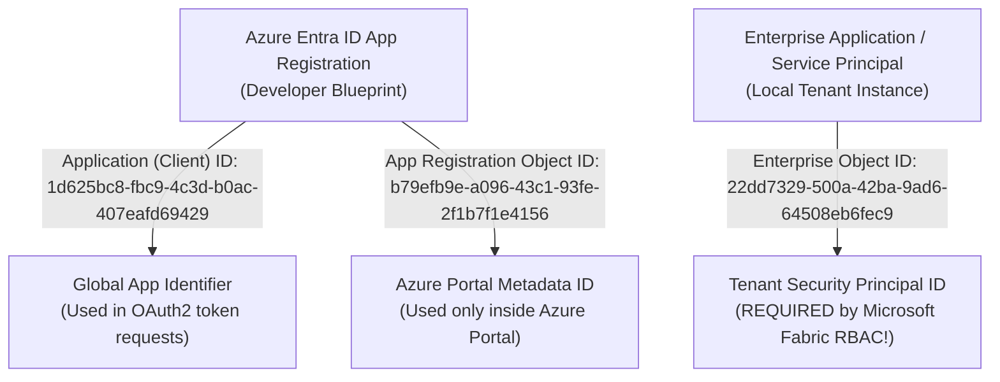

# Microsoft Fabric Real-Time Job Monitoring: Files & Object ID Guide

This guide explains **every file created in this repository**, its specific responsibility, and the technical journey of **how we identified and extracted the Enterprise Object ID** to automate tenant-wide workspace access.

---

## 1. How We Discovered & Extracted the Enterprise Object ID

In Microsoft Entra ID (Azure AD), every Service Principal actually has **three different IDs**. Misunderstanding these IDs is the #1 reason developers get `PrincipalNotFound` errors in Microsoft Fabric.

### The Three Entra ID Identifiers:



| ID Name | Value in This Project | Purpose | Where Used |
| :--- | :--- | :--- | :--- |
| **Application (Client) ID** | `1d625bc8-fbc9-4c3d-b0ac-407eafd69429` | The public client identifier of the app registration. | Used in OAuth2 token acquisition (`POST /token`). |
| **App Registration Object ID** | `b79efb9e-a096-43c1-93fe-2f1b7f1e4156` | The internal Azure Portal ID of the app registration object. | Used only within Microsoft Entra ID management blades. |
| **Enterprise Object ID** | **`22dd7329-500a-42ba-9ad6-64508eb6fec9`** | The security principal object created inside your specific tenant. | **The ONLY ID accepted by Fabric's `roleAssignments` API.** |

---

### Why the Initial Script Failed with `PrincipalNotFound`:
When we first ran the automated assignment script, we passed the **Application (Client) ID** (`1d625bc8-...`) into Fabric's `roleAssignments` endpoint. Fabric rejected it:
```json
{
  "errorCode": "PrincipalNotFound",
  "message": "The provided principal was not found",
  "relatedResource": { "resourceId": "1d625bc8-fbc9-4c3d-b0ac-407eafd69429" }
}
```
Fabric expects the **Enterprise Service Principal Object ID**, not the Application ID.

---

### The Step-by-Step Method We Used to Extract It:

#### Method 1: The Azure Portal Link Method
1. In the Azure Portal, open **App registrations** $	o$ **Fabric-Job-Monitoring-App**.
2. Look at the right-hand panel of the **Overview** page under **Essentials**.
3. Locate the field: **`Managed application in local directory`**.
4. Click on the blue link: **`Fabric-Job-Monitoring-App`**.
5. This opens the **Enterprise Application** blade. The **Object ID** displayed on that page is **`22dd7329-500a-42ba-9ad6-64508eb6fec9`**.

#### Method 2: The Live Fabric API Inspection Method (How we verified it programmatically)
1. You added `Fabric-Job-Monitoring-App` to the workspace `fabric learning` once in the Fabric UI.
2. Fabric UI automatically resolved the Enterprise identity behind the scenes.
3. We queried the Fabric Role Assignments API:
   ```http
   GET https://api.fabric.microsoft.com/v1/workspaces/4d19f1c8-9ab6-4c40-99c4-62803626edbd/roleAssignments
   ```
4. Fabric returned the full identity payload:
   ```json
   {
     "id": "22dd7329-500a-42ba-9ad6-64508eb6fec9",
     "principal": {
       "id": "22dd7329-500a-42ba-9ad6-64508eb6fec9",
       "displayName": "Fabric-Job-Monitoring-App",
       "type": "ServicePrincipal",
       "servicePrincipalDetails": {
         "aadAppId": "1d625bc8-fbc9-4c3d-b0ac-407eafd69429"
       }
     },
     "role": "Admin"
   }
   ```
5. We captured `22dd7329-500a-42ba-9ad6-64508eb6fec9` and baked it into `add_sp_to_workspaces.py`.
6. With this exact ID, the script successfully provisioned **all 5 shared workspaces across your entire tenant** with zero errors!

---

## 2. Complete File Directory & Component Breakdown

```
mymonitor/
├── .env                               # Environment credentials, SMTP configuration & timeouts
├── add_sp_to_workspaces.py            # Automated bulk tenant workspace assignment script
├── verify_sp_access.py                # Standalone diagnostic test script
├── check_pipeline_runs.py             # Utility to inspect raw pipeline job runs
├── README.md                          # Master project README (Comprehensive system guide)
│
├── readme/                            # Dedicated technical documentation folder
│   ├── ARCHITECTURE_GUIDE.md          # 4-tier optimization, SQLite WAL, 9-table catalog, concurrency & SLA
│   ├── IMPLEMENTATION_AND_SCREENS.md  # Screen-by-screen UI walkthrough & requirements matrix
│   └── FILES_AND_OBJECTID_GUIDE.md    # This file (Enterprise Object ID discovery & codebase map)
│
├── backend/                           # High-performance FastAPI Backend
│   ├── README.md                      # Backend architecture & developer guide
│   ├── requirements.txt               # Backend Python dependencies
│   ├── data/
│   │   └── fabric_monitor.db          # High-speed SQLite WAL database (9 tables)
│   └── app/
│       ├── __init__.py                # App package init & sys.path configuration
│       ├── main.py                    # App entrypoint, lifespan poller, static UI hosting
│       ├── core/
│       │   ├── config.py              # Pydantic settings loading from .env (SMTP, Azure, limits)
│       │   └── rate_limiter.py        # Concurrency semaphore (limits calls to 5 parallel)
│       ├── models/
│       │   └── monitoring.py          # Pydantic schemas (PipelineRun, ActivityRun, SlaConfig, Incidents)
│       ├── services/
│       │   ├── db_service.py          # SQLite engine, 9-table schema, indexing, run caching, date engine
│       │   ├── fabric_client.py       # OAuth2 token caching & Fabric REST client
│       │   ├── connection_manager.py  # WebSocket room manager (1-to-N multiplexing)
│       │   ├── leased_poller.py       # On-demand poller (differential polling for InProgress runs)
│       │   ├── tree_builder.py        # 100% dynamic ExecutePipeline parent-child hierarchy
│       │   ├── alert_service.py       # SLA watchdog background worker for breach evaluation
│       │   ├── email_service.py       # Gmail SMTP dispatcher for L1/L2 HTML alerts
│       │   ├── ai_diagnostic_service.py # Google Gemini 3.6 Flash diagnostics & SHA-256 error caching
│       │   └── table_log_service.py   # Dynamic Lakehouse/Warehouse table logging & ETL lineage
│       └── api/
│           ├── routes_workspaces.py   # REST: list workspaces, pipelines, snapshot, history, schedules, table logs
│           ├── routes_sla.py          # REST: SLA config CRUD, SMTP test email, incident resolution
│           └── websocket_hub.py       # WS: /ws/workspaces/{workspace_id} with snapshot push
│
└── frontend/                          # Real-Time React Dashboard
    ├── README.md                      # Frontend architecture, component hierarchy & build guide
    ├── package.json                   # Dependencies (React 19, Lucide, Tailwind v4)
    ├── vite.config.js                 # Vite config with Tailwind v4 & backend proxy
    ├── dist/                          # Compiled production frontend bundle
    └── src/
        ├── main.jsx                   # React entrypoint with global ErrorBoundary
        ├── index.css                  # Dark theme base styles & Tailwind imports
        ├── App.jsx                    # Root coordinator component
        ├── hooks/
        │   └── useWorkspaceMonitoring.js # Auto-reconnecting WebSocket hook
        └── components/
            ├── WorkspaceSelector.jsx  # Searchable tenant-wide workspace dropdown
            ├── DashboardHeader.jsx    # Live connection badge, viewers count & Table Log Config button
            ├── DateFilterBar.jsx      # Name search, quick presets, 15-day strip & forecast tabs
            ├── PipelineTreeTable.jsx  # Hierarchical collapsible table with status filters
            ├── PipelineRow.jsx        # Pipeline row with duration, SLA badges, History/SLA buttons
            ├── ActivityList.jsx       # Granular activity telemetry & type icons
            ├── ErrorDetailModal.jsx   # Gemini 3.6 Flash AI diagnostics, fix steps & raw output
            ├── RunHistoryModal.jsx    # Complete historical runs modal with inner activity inspection
            ├── SlaConfigModal.jsx     # SLA threshold configuration & live email test verification
            ├── SlaIncidentBanner.jsx  # Live breach alert banner with 1-click incident resolution
            ├── PipelineScheduleModal.jsx # Multi-schedule cards (Daily, Weekly, days, UTC/local times)
            ├── TableLogConfigModal.jsx   # Dynamic Lakehouse/Warehouse schema & column mapping modal
            ├── TableLogDashboardModal.jsx # Full ETL table log lineage & row counts dashboard
            ├── SchedulesDrawer.jsx    # Slide-over drawer for scheduled next runs
            └── ErrorBoundary.jsx      # Global React crash protection component
```

---

## 3. What Each File Actually Does

### Root Scripts & Configuration
* **`.env`:**  
  Stores the verified Microsoft Entra ID credentials (`AZURE_TENANT_ID`, `AZURE_CLIENT_ID`, `AZURE_CLIENT_SECRET`), Gmail SMTP credentials (`MAIL_USERNAME`, `MAIL_PASSWORD`, `MAIL_SERVER`), active/idle polling intervals (`3.5s` / `15.0s`), maximum parallel Fabric requests (`5`), and optional Google Gemini API key (`GEMINI_API_KEY`).
* **`add_sp_to_workspaces.py`:**  
  Automated bulk tenant workspace assignment script. Discovers all tenant workspaces using Tenant Admin APIs and assigns the Enterprise Service Principal (`22dd7329-500a-42ba-9ad6-64508eb6fec9`) as `Viewer` across all tenant workspaces.
* **`verify_sp_access.py`:**  
  Diagnostic script that authenticates with Entra ID, tests Fabric REST connectivity, and prints all accessible workspaces and pipelines.
* **`check_pipeline_runs.py`:**  
  Inspects recent execution run instances, start/end timestamps, and execution statuses for all pipelines in a workspace.

---

### Backend Components (`backend/app/`)
* **`main.py`:**  
  FastAPI application entrypoint. Configures CORS, initializes background workers (`leased_poller`, `alert_service`) during startup lifespan, mounts REST and WebSocket routers, and serves compiled frontend static files on port `8000`.
* **`services/db_service.py`:**  
  High-speed SQLite persistence engine. Manages WAL mode, 30s busy timeout, **9 core tables** (`workspaces`, `pipelines`, `pipeline_runs`, `activity_runs`, `pipeline_schedules`, `sla_configs`, `sla_incidents`, `table_log_mappings`, `ai_error_diagnostics`), composite indexes, duration calculations, date-filtering engine (`get_workspace_tree_by_date`), and sub-15ms cached tree generation.
* **`services/fabric_client.py`:**  
  Entra ID OAuth2 client and Microsoft Fabric REST API client with automatic token renewal and official schedule endpoint queries (`/items/{itemId}/jobs/Pipeline/schedules`).
* **`services/tree_builder.py`:**  
  Dynamic hierarchy engine. Discovers child pipelines from `ExecutePipeline` activities (`childJobInstanceId` / `pipelineRunId`), nests them under parent runs, and removes child pipelines from the top-level workspace list.
* **`services/connection_manager.py`:**  
  1-to-N WebSocket room multiplexer. Ensures all users viewing the same workspace share a single broadcast stream.
* **`services/leased_poller.py`:**  
  Leased poller worker. Polls Microsoft Fabric only for workspaces with active WebSocket viewers. Bypasses completed/failed runs and queries Fabric only for `InProgress` runs.
* **`services/alert_service.py`:**  
  SLA watchdog worker. Runs every 10 seconds, evaluates active run durations against SLA thresholds, records incidents in `sla_incidents`, and triggers L1/L2 email alerts.
* **`services/email_service.py`:**  
  Gmail SMTP client. Formats responsive HTML email alert cards with failure details, durations, and error logs, and dispatches them via `smtp.gmail.com:587 TLS`.
* **`services/ai_diagnostic_service.py`:**  
  Google Gemini 3.6 Flash AI diagnostic engine (`gemini-3.6-flash`). Parses error codes, failure types, and driver logs to generate structured root-cause explanations, probable cause checklists, numbered remediation guides, and ready-to-run fix scripts. Caches analyses by SHA-256 error signature in SQLite table `ai_error_diagnostics` for sub-5ms instant responses.
* **`services/table_log_service.py`:**  
  Dynamic Lakehouse and Warehouse table logging service. Introspects SQL Endpoint metadata (`sys.tables`, `sys.columns`), saves user-configured column mappings in `table_log_mappings`, and correlates `pipeline_run_id` across Batch Header $\rightarrow$ Bronze Log $\rightarrow$ Silver Log tables with row-count and operation tracking (`Data Load` vs `Source Delete`).
* **`api/routes_workspaces.py`:**  
  REST endpoints for listing workspaces, pipelines, hierarchical snapshot, execution history, upcoming schedules, date-filtered pipeline trees, AI diagnostics, and table log queries.
* **`api/routes_sla.py`:**  
  REST endpoints for fetching/updating SLA configs, testing email dispatch, and resolving active incidents.
* **`api/websocket_hub.py`:**  
  WebSocket endpoint `/ws/workspaces/{workspace_id}` for real-time telemetry streaming.

---

### Frontend Components (`frontend/src/`)
* **`App.jsx`:**  
  Root React coordinator managing WebSocket telemetry, date filtering state, modal toggles, and main views.
* **`hooks/useWorkspaceMonitoring.js`:**  
  Custom hook managing resilient WebSocket streaming with auto-reconnection and exponential backoff.
* **`components/DashboardHeader.jsx`:**  
  Top bar displaying live WebSocket status badge, active viewers count (`👥 X active viewers`), and button to launch the Lakehouse/Warehouse Table Log Config modal.
* **`components/WorkspaceSelector.jsx`:**  
  Searchable dropdown that discovers all tenant workspaces and allows switching with zero page reloads.
* **`components/DateFilterBar.jsx`:**  
  Interactive date navigation bar featuring text search, quick presets (`Last Week`, `Yesterday`, `Today`, `Tomorrow`, `Next Week`, `Latest / All`), 15-day strip with activity dots (green = recorded runs, purple = future forecast), and status filter tabs.
* **`components/PipelineTreeTable.jsx`:**  
  Hierarchical table with search filter, status filter pills, and parent-child pipeline nesting.
* **`components/PipelineRow.jsx`:**  
  Pipeline row rendering calculated duration, trigger type, formatted SLA badges (`+4d 3h 15m`), 1-click incident resolve button, History button, Schedule button, SLA button, and Table Logs button.
* **`components/ActivityList.jsx`:**  
  Granular activity telemetry table with type icons, live status spinners, calculated duration, and "View Error" buttons.
* **`components/ErrorDetailModal.jsx`:**  
  Deep diagnostic modal enriched with Google Gemini 3.6 Flash AI diagnostics, Root Cause analysis, likely causes, step-by-step fix guide, 1-click script copy, instant cache badge (`⚡ Instant Cached`), and raw execution JSON.
* **`components/RunHistoryModal.jsx`:**  
  Full historical execution archive modal showing all past runs, inner activities, durations, and error diagnostics.
* **`components/SlaConfigModal.jsx`:**  
  Modal to configure SLA warning/breach thresholds, L1/L2 emails, and test SMTP connectivity with live toast feedback.
* **`components/SlaIncidentBanner.jsx`:**  
  Top banner for active SLA breaches with 1-click "Resolve" button.
* **`components/PipelineScheduleModal.jsx`:**  
  Dedicated modal displaying all configured trigger schedules for a pipeline, featuring Daily and Weekly recurrence cards, trigger times in UTC/local timezone, days of week, and next run calculations.
* **`components/TableLogConfigModal.jsx`:**  
  4-step dynamic schema and column mapping modal to introspect Lakehouse/Warehouse SQL Endpoints and map Batch Header, Bronze Log, and Silver Log tables with zero hardcoding.
* **`components/TableLogDashboardModal.jsx`:**  
  Full ETL table log dashboard modal correlating `pipeline_run_id` to Batch Header, displaying 5 KPI cards, Silver and Bronze layer overviews, operation filters (`Data Load` vs `Source Delete`), row-count progressions, and integrated Gemini AI table-load debugging.
* **`components/SchedulesDrawer.jsx`:**  
  Slide-over drawer detailing upcoming scheduled runs and frequencies across the entire workspace.
* **`components/ErrorBoundary.jsx`:**  
  Global React crash shield preventing unhandled UI exceptions from causing a blank screen.
\n